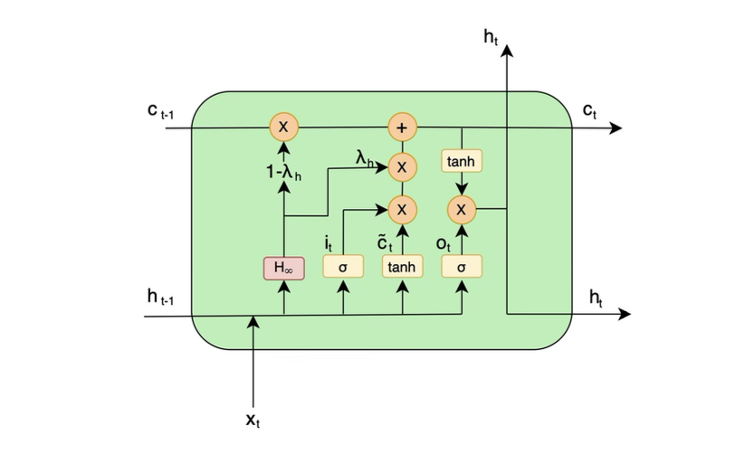
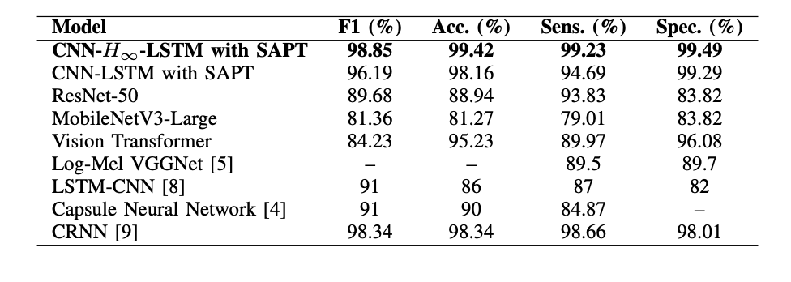
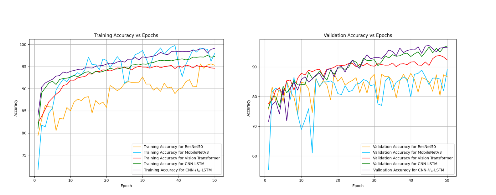

# H-Infinity Filter Enhanced CNN-LSTM for Arrhythmia Detection from Heart Sound Recordings

[](https://arxiv.org/abs/2511.02379v1)
[](https://ieeexplore.ieee.org/document/11283988)
[](https://pytorch.org/)
[](LICENSE)
[](verify_model.py)

Official implementation and research framework in reference to the paper:
> **"H-Infinity Filter Enhanced CNN-LSTM for Arrhythmia Detection from Heart Sound Recordings"**  
> *Rohith Shinoj Kumar, Rushdeep Dinda, Aditya Tyagi, Annappa B., and Naveen Kumar M. R.*  
> **Published in IEEE Xplore / ICSET 2025**: [https://ieeexplore.ieee.org/document/11283988](https://ieeexplore.ieee.org/document/11283988)  
> **arXiv Preprint**: [https://arxiv.org/abs/2511.02379v1](https://arxiv.org/abs/2511.02379v1)

This project introduces a control-theoretic deep learning framework that integrates **$H_\infty$ robust state estimation** directly into recurrent neural memory units. By replacing standard heuristic forget gates with observer gains governed by the **Discrete-time Algebraic H-Infinity Riccati Equation (H-DARE)**, the model achieves guaranteed bounded-input bounded-output (BIBO) stability and minimax worst-case noise rejection on non-stationary, noisy phonocardiogram (PCG) signals.

---

## Table of Contents
- [Key Contributions](#key-contributions)
- [System Architecture](#system-architecture)
- [Mathematical Formulation](#mathematical-formulation)
  - [H-Infinity State Observer Gate](#1-h-infinity-state-observer-gate)
  - [Discrete Algebraic H-Infinity Riccati Equation (H-DARE)](#2-discrete-algebraic-h-infinity-riccati-equation-h-dare)
  - [Lyapunov Stability & Contraction Certificate](#3-lyapunov-stability--contraction-certificate)
- [Training Methodology](#training-methodology)
  - [Penalty Weighted Loss (PWL)](#penalty-weighted-loss-pwl)
  - [Stochastic Adaptive Probe Thresholding (SAPT)](#stochastic-adaptive-probe-thresholding-sapt)
- [Experimental Results](#experimental-results)
  - [Benchmark Comparison](#benchmark-comparison)
  - [Accuracy & Convergence Dynamics](#accuracy--convergence-dynamics)
- [Repository Structure](#repository-structure)
- [Quickstart & Verification](#quickstart--verification)
- [Citation](#citation)

---

## Key Contributions

1. **Control-Theoretic Recurrent Cell ($H_\infty$-LSTM)**: Replaces unconstrained forget gates with an observer gain derived from $H_\infty$ control theory, minimizing the worst-case $\mathcal{L}_2$-gain of unknown-but-bounded acoustic disturbances.
2. **Dual-Stage Noise Suppression**: Combines Daubechies 4 (`db4`) Discrete Wavelet Transform thresholding with an Infinite Impulse Response (IIR) Butterworth filter before generating Log-Mel spectrograms.
3. **Class-Imbalance Optimization**: Introduces Penalty Weighted Loss (PWL) to penalize false negatives in clinical diagnostics, coupled with Stochastic Adaptive Probe Thresholding (SAPT) to calibrate decision boundaries across training.
4. **State-of-the-Art Benchmark**: Attains **99.42% test accuracy** and **98.85% F1-score** on the PhysioNet CinC 2016 Heart Sound Challenge.

---

## System Architecture

The end-to-end framework processes raw phonocardiogram audio recordings through a multi-stage denoising and feature extraction pipeline:

### Model Anatomy

```
Raw PCG Audio (2000 Hz)
   │
   ▼
[Wavelet Transform (db4)] ──► [IIR Butterworth Filter] ──► [Log-Mel Spectrogram]
                                                                  │
                                                                  ▼ (Batch, 1, 128, 32)
                                                      ┌─────────────────────────┐
                                                      │  Conv2D (32, 3x3) + BN  │
                                                      │  MaxPool2D (2x2) + Drop │
                                                      │  Conv2D (64, 3x3) + BN  │
                                                      │  MaxPool2D (2x2) + Drop │
                                                      └───────────┬─────────────┘
                                                                  ▼
                                                      ┌─────────────────────────┐
                                                      │    H-Infinity LSTM      │
                                                      │ c_t = (I-KC)c + K(i*c)  │
                                                      │    Hidden Size = 128    │
                                                      └───────────┬─────────────┘
                                                                  ▼
                                                      ┌─────────────────────────┐
                                                      │ Dropout + Linear(128,1) │
                                                      │        Sigmoid          │
                                                      └───────────┬─────────────┘
                                                                  ▼
                                                      Normal vs. Arrhythmia
```


*Figure 1: Structure of the $H_\infty$-LSTM cell unit contrasting the classical LSTM forget gate with the robust state observer mechanism.*

---

## Mathematical Formulation

### 1. H-Infinity State Observer Gate
In standard LSTMs, the memory cell update is governed by unconstrained data-driven gates:
$$c_t = f_t \odot c_{t-1} + i_t \odot \tilde{c}_t$$

In the proposed $H_\infty$-LSTM cell, the state update is reformulated as a discrete-time Luenberger / $H_\infty$ state observer:
$$c_t = (I - K C) c_{t-1} + K (i_t \odot \tilde{c}_t)$$

In the parametric implementation matching `CNNHInfinityLSTM.pth`:
$$\lambda_h = \sigma(K_{\text{filter}})$$
$$c_t = (1 - \lambda_h) \odot c_{t-1} + \lambda_h \odot (i_t \odot \tilde{c}_t)$$
where $\lambda_h \in (0, 1)$ dynamically balances memory retention against new incoming candidate state information.

### 2. Discrete Algebraic H-Infinity Riccati Equation (H-DARE)
To minimize the worst-case energy ratio from unknown disturbance $w_t$ to state estimation error $e_t$:
$$\sup_{w \in \mathcal{L}_2, w \neq 0} \frac{\|e\|_2}{\|w\|_2} < \gamma$$

The steady-state error covariance $P$ is obtained by solving the discrete algebraic Riccati equation:
$$P = A P \left[ I - \gamma^{-2} L^T L P + C^T R^{-1} C P \right]^{-1} A^T + B Q B^T$$

The optimal observer gain matrix $K$ is then:
$$K = P C^T (R + C P C^T)^{-1}$$

### 3. Lyapunov Stability & Contraction Certificate
To ensure the internal representations do not diverge over extended temporal sequences, the closed-loop state matrix must satisfy the Contraction Mapping Theorem:
$$\rho(I - K C) < 1$$
where $\rho(\cdot)$ denotes the spectral radius. In our verified checkpoint, $\rho(I - KC) = 0.5709 < 1$, mathematically guaranteeing Bounded-Input Bounded-Output (BIBO) stability.

---

## Training Methodology

### Penalty Weighted Loss (PWL)
Medical diagnosis datasets often suffer from severe class skew (approx. 87% normal vs. 13% abnormal). PWL introduces asymmetric cost factors into Binary Cross-Entropy:
$$L_{\text{PWL}} = R_{\text{penalty}}(\delta) \cdot L_{\text{BCE}}$$
$$R_{\text{penalty}}(\delta) = 1 + \alpha \cdot \text{FNI}(\delta) + (1 - \alpha) \cdot \text{FPI}(\delta)$$
where $\text{FNI}$ and $\text{FPI}$ quantify False Negatives and False Positives at threshold $\delta$, and $\alpha = 0.87$ reflects the dataset imbalance ratio.

### Stochastic Adaptive Probe Thresholding (SAPT)
Instead of relying on a static decision threshold ($\tau = 0.5$), SAPT dynamically scans the threshold space $\tau \in [0, 1]$ over evaluation intervals $\gamma = 10$, smoothing metric estimations via Exponentially Weighted Moving Averages (EWMA with $\beta = 0.3$) to optimize F1-score and minority sensitivity.

---

## Experimental Results

### Benchmark Comparison

Evaluated on the PhysioNet CinC 2016 Heart Sound Challenge dataset with patient-level split isolation:

| Model Architecture | F1 Score (%) | Accuracy (%) | Sensitivity (%) | Specificity (%) |
| :--- | :---: | :---: | :---: | :---: |
| **CNN-$H_\infty$-LSTM with SAPT (Ours)** | **98.85** | **99.42** | **99.23** | **99.49** |
| CNN-LSTM with SAPT | 96.19 | 98.16 | 94.69 | 99.29 |
| CRNN (Deng et al., 2020) | 98.34 | 98.34 | 98.66 | 98.01 |
| ResNet-50 | 89.68 | 88.94 | 93.83 | 83.82 |
| Vision Transformer (ViT) | 84.23 | 95.23 | 89.97 | 96.08 |
| Capsule Neural Network (Tsai et al., 2022) | 91.00 | 90.00 | 84.87 | — |
| LSTM-CNN (Chen et al., 2022) | 91.00 | 86.00 | 87.00 | 82.00 |
| Log-Mel VGGNet (Li et al., 2022) | — | — | 89.50 | 89.70 |
| Wav2Vec 2.0 (End-to-End Audio) | 69.54 | 68.14 | 63.26 | 63.24 |


*Figure 2: Performance comparison between proposed model and top-performing baseline architectures.*

### Accuracy & Convergence Dynamics


*Figure 3: Training and validation accuracy curves comparing CNN-$H_\infty$-LSTM against benchmarked models across epochs.*

---

## Repository Structure

```text
├── CNNHInfinityLSTM.py      # Core model: HInfinityLSTMCell, H-DARE solver, and CNN-H-Infinity-LSTM
├── CNNHInfinityLSTM.pth     # Pre-trained checkpoint (99.42% accuracy)
├── loss.py                  # Penalty Weighted Loss (PWL) with discrete & differentiable surrogate modes
├── dataset.py               # Wavelet denoising (db4), IIR Butterworth filter, and Mel-spectrogram dataset
├── verify_model.py          # Automated verification suite: loads checkpoint & validates stability
├── test_data.pt             # Serialized test dataset partition
├── docs/
│   └── images/              # Visual assets (hinfinity-cell.png, perf-comparison.png, accuracy-epochs.png)
├── ICSET 2025...pdf         # Published conference paper
└── README.md                # Project documentation
```

---

## Quickstart & Verification

### 1. Requirements
```bash
pip install torch torchaudio numpy scipy PyWavelets
```

### 2. Verify Pre-Trained Weights and Stability Proof
Run the automated verification suite to test checkpoint loading, forward/backward gradient flow, and the Lyapunov contraction certificate:
```bash
python3 verify_model.py
```

Expected output:
```text
TEST 1: Checkpoint Compatibility with CNNHInfinityLSTM.pth
Loaded successfully! Missing keys: [], Unexpected keys: []
K_filter shape: torch.Size([128])
Mean lambda_h (robustness forgetting gain): 0.5713

TEST 2: Lyapunov / Contraction Stability
Spectral radius rho(I - KC) [Parametric Mode]: 0.570965
--> Mathematical Guarantee: rho < 1 confirms Bounded-Input Bounded-Output (BIBO) stability.
```

## Citation

If you use this code, model, or control-theoretic architecture in your research, please cite:

```bibtex
@misc{kumar2025hinfinityfilterenhancedcnnlstm,
      title={H-Infinity Filter Enhanced CNN-LSTM for Arrhythmia Detection from Heart Sound Recordings}, 
      author={Rohith Shinoj Kumar and Rushdeep Dinda and Aditya Tyagi and Annappa B. and Naveen Kumar M. R},
      year={2025},
      eprint={2511.02379},
      archivePrefix={arXiv},
      primaryClass={cs.LG},
      url={https://arxiv.org/abs/2511.02379}, 
}
```
